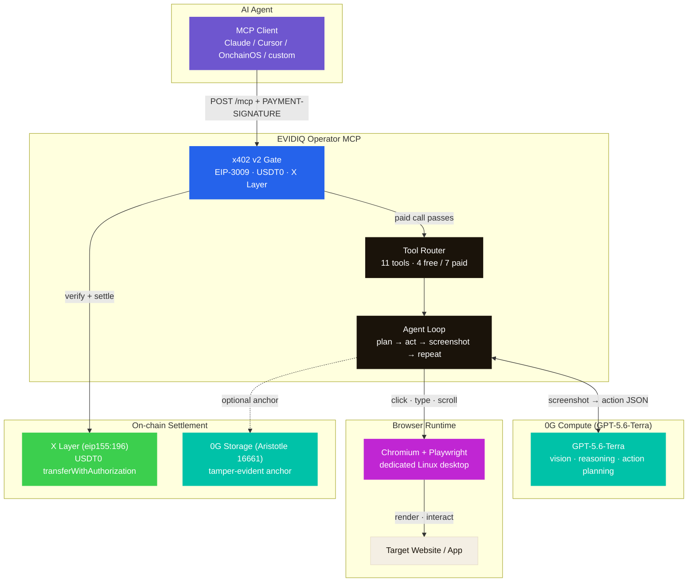

<p align="center">
  
</p>

<h1 align="center">EVIDIQ Operator</h1>

<p align="center"><strong>Computer Use Infrastructure for Autonomous AI Agents.</strong></p>

<p align="center">
  Reason &middot; Execute &middot; Return — any agent can drive a real browser, autonomously.
</p>

<p align="center">
  <a href="https://mcp.evidiq.dev/operator/mcp"></a>
  <a href="https://0g.ai"></a>
  <a href="https://www.oklink.com/xlayer"></a>
  <a href="https://mcp.evidiq.dev/operator/x402"></a>
  <a href="https://okx.ai"></a>
  <a href="./LICENSE"></a>
</p>

---

Autonomous agents can already discover each other, negotiate, and pay. What they
still lack is a way to **act on the web** — login to a portal, fill a form,
download a document, run a multi-step workflow — without a human pressing the buttons.

**EVIDIQ Operator is the computer-use layer for the AI agent economy.**
Delivered as a remote MCP server, billed per call over x402, listed on OKX.AI.

An LLM (GPT-5.6-Terra running via 0G Compute) plans each action from screenshots
and drives a real Chromium browser on dedicated Linux desktop infrastructure.
The agent never runs browser code itself — it only describes the next action,
and we execute it. Every call returns structured JSON.

## What it does

- **Browser automation** — natural-language task → structured JSON result.
- **Web interaction** — login, fill forms, navigate, extract data, download documents.
- **Multi-step workflows** — chained sequences on a single persistent browser session.
- **Verifiable** — every paid call can be anchored on 0G Storage (tamper-evident audit trail).
- **Pay-per-call** — no API keys, no accounts, no subscriptions. Just x402 USDT0.

## Use it from any agent

```bash
# Live pricing discovery
curl -s https://mcp.evidiq.dev/operator/x402

# Connect the remote MCP server (Claude Code, Cursor, OnchainOS, custom)
claude mcp add --transport http evidiq-operator https://mcp.evidiq.dev/operator/mcp
```

`health`, `capabilities`, `supported_targets`, and `estimate_cost` are free.
The seven browser tools are **pay-per-call over
[x402](https://mcp.evidiq.dev/operator/x402)**: unauthenticated requests receive
an HTTP 402 challenge; sign it and retry.

## MCP Tools

| Tool | Cost | Description |
|------|------|-------------|
| `browser_task` | $0.02 USDT0 | Natural-language browser task — LLM plans + executes |
| `login_and_extract` | $0.02 USDT0 | Login to a site + extract data |
| `fill_form` | $0.02 USDT0 | Fill + submit a form |
| `download_document` | $0.02 USDT0 | Download a file from a site |
| `navigate` | $0.02 USDT0 | Go to URL, return screenshot |
| `screenshot` | $0.02 USDT0 | Single snapshot of current page |
| `multi_step_workflow` | $0.02 USDT0 | Chained multi-step browser workflow |
| `health` | Free | Service health + pool telemetry |
| `capabilities` | Free | List tools + pricing |
| `supported_targets` | Free | What sites/workflows are supported |
| `estimate_cost` | Free | Estimate cost for a task |

## How it settles

EVIDIQ Operator owns reasoning, browser execution, and verification, and settles
on open infrastructure:

- **0G Compute** — GPT-5.6-Terra runs inside a Trusted Execution Environment. The model
  sees screenshots, decides the next action (click, type, scroll, navigate, extract),
  and returns structured JSON. The LLM never runs browser code.
- **Dedicated browser infrastructure** — Chromium + Playwright on isolated Linux
  desktop runtimes, spawned on demand, reused while warm, auto-cleaned between calls.
- **x402 v2** — per-call settlement (EIP-3009 `exact` / `transferWithAuthorization`),
  gasless for the payer, settled on-chain by the server.
- **X Layer / USDT0** — the OKX A2MCP settlement token (`0x779ded…`, 6 decimals).
  `$0.02 = 20000` atomic.
- **0G Storage** — paid calls optionally anchored on 0G mainnet (Aristotle, chain 16661).

## Proven on-chain

| | |
|---|---|
| Amount | `0.02 USDT0` on X Layer (`eip155:196`) |
| Flow | HTTP 402 → EIP-3009 signature → `transferWithAuthorization` (gasless for the payer) |
| Engine | GPT-5.6-Terra in 0G Compute (screenshot → action → execute → repeat) |
| Pricing discovery | `https://mcp.evidiq.dev/operator/x402` (per-tool table, 11 entries) |

## Architecture



<details>
<summary>ASCII version (for non-GitHub viewers)</summary>

```
┌─────────────────────┐
│   🤖 AI Agent       │
│   (MCP Client)      │
└──────────┬──────────┘
           │ POST /mcp + PAYMENT-SIGNATURE
           ▼
┌─────────────────────┐    ┌──────────────────────┐
│  ⚡ x402 v2 Gate    │───▶│  ⛓️ X Layer          │
│  EIP-3009 · USDT0   │    │  USDT0 settle        │
└──────────┬──────────┘    └──────────────────────┘
           │ paid call passes
           ▼
┌─────────────────────┐
│  🧰 Tool Router     │
│  11 tools (4/7)     │
└──────────┬──────────┘
           ▼
┌─────────────────────┐    ┌──────────────────────┐
│  🔁 Agent Loop      │◄──▶│  🔒 0G Compute   │
│  plan → act → shot  │    │  GPT-5.6-Terra             │
└──────────┬──────────┘    └──────────────────────┘
           │ click · type · scroll · navigate
           ▼
┌─────────────────────┐    ┌──────────────────────┐
│  🌐 Browser Runtime │───▶│  🌍 Target Website   │
│  Chromium + PW      │    │  (URL target)        │
└─────────────────────┘    └──────────────────────┘
           │
           └─── optional ──▶ 0G Storage (anchor)
```

</details>

## Self-host

```bash
# Build & run (Docker)
docker build -t evidiq-operator .
docker run -d -p 3000:3000 --env-file .env evidiq-operator

# Or from source
npm install && npm run build
PORT=3000 node dist/start-server.js
```

Endpoint: `POST /mcp` · Discovery: `GET /x402` · Health: `GET /`

### Configuration

```bash
# Server
PORT=3000
HOSTNAME=0.0.0.0

# Notary/attest signing key (EVM, EIP-191) — same as EVIDIQ main + Notary
NOTARY_PRIVATE_KEY=0x...
OG_PRIVATE_KEY=0x...

# x402 payment (X Layer mainnet, USDT0)
X402_CHAIN=x-layer
X402_ASSET=0x779ded0c9e1022225f8e0630b35a9b54be713736
X402_PAY_TO=0x2a8efe3093278bb4bd3b2d9c7b5ba992ca4fc9b0
X402_PRICE=20000                  # $0.02 USDT0 (6 decimals)
X402_DOMAIN_NAME=USD₮0
X402_DOMAIN_VERSION=1
X402_SETTLE_KEY=0x...             # Gas-funded X Layer wallet
X402_RPC=https://rpc.xlayer.tech

# 0G Storage (mainnet Aristotle, chain 16661)
OG_STORAGE_RPC=https://evmrpc.0g.ai
OG_STORAGE_INDEXER=https://indexer-storage-turbo.0g.ai

# 0G Compute Router ( GPT-5.6-Terra)
OG_COMPUTE_API_KEY=sk-...
OG_COMPUTE_BASE_URL=https://router-api.0g.ai/v1
OG_COMPUTE_MODEL=gpt-5.6-terra

# Browser runtime (internal — provider is an implementation detail, not exposed in user-facing metadata)
BROWSER_API_KEY=...
BROWSER_TEMPLATE_ID=
BROWSER_RESOLUTION_WIDTH=1024
BROWSER_RESOLUTION_HEIGHT=720
BROWSER_TIMEOUT_MS=300000
BROWSER_IDLE_TTL_MS=600000
BROWSER_POOL_MAX=100
```

## Result structure

```json
{
  "task": "Login to example.com and extract the dashboard balance",
  "success": true,
  "steps": 8,
  "summary": "Logged in as user@example.com, extracted balance: $12,450.00",
  "extractedData": { "balance": "$12,450.00", "account": "premium" },
  "storageRoot": "0x…",
  "storageTx": "0x…",
  "stepLog": [
    { "step": 1, "action": "navigate" },
    { "step": 2, "action": "click" },
    { "step": 3, "action": "type" },
    { "step": 4, "action": "click" },
    { "step": 5, "action": "screenshot" },
    { "step": 6, "action": "extract" },
    { "step": 7, "action": "screenshot" },
    { "step": 8, "action": "done" }
  ]
}
```

## Development

```bash
npm install      # install deps
npm run build    # tsc → dist/
npm run dev      # tsx watch server.ts
```

## Links

- **Live endpoint** — https://mcp.evidiq.dev/operator/mcp
- **Pricing discovery** — https://mcp.evidiq.dev/operator/x402
- **EVIDIQ main** — https://github.com/evidiq/evidiq
- **EVIDIQ Notary** — https://github.com/evidiq/evidiq-notary-mcp
- **EVIDIQ skill** — https://github.com/evidiq/evidiq-skill
- **0G Labs** — https://0g.ai
- **x402 Protocol** — https://x402.org
- **OKX.AI** — https://okx.ai

## License

MIT © 2026 EVIDIQ — see [LICENSE](./LICENSE). Part of the
[EVIDIQ](https://github.com/evidiq/evidiq) trust + execution layer for the AI agent economy.
